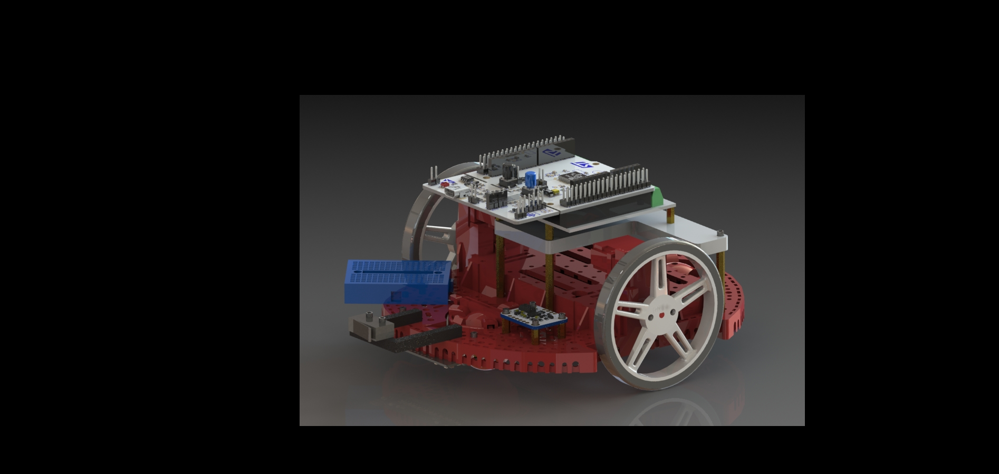
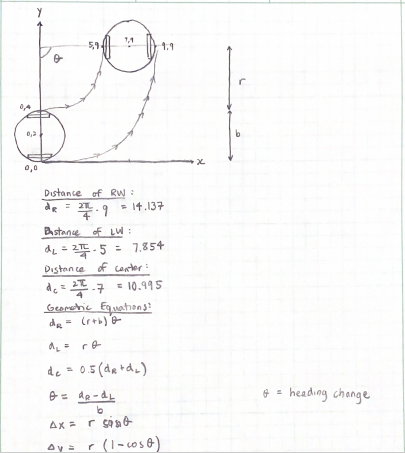

# Girlfriend #2 - Term Project
#### Designed, Created by Noah Tanner and Kosimo Tonn
#### ME 405 - Professor Refvem
#### California Polytechnic State University, San Luis Obispo

## <u>Overview</u>
Girlfriend #2 is a line following robot designed to follow a course designed specifically for the term project competition. Our design emphasizes simplicity and minimalism, as we have found that complexity in mechatronics projects should be avoided if there is a simpler solution. The specific requirements for the project can be found in the [references](#references) section.



## <u>Hardware Setup and Design</u>
The components that we were provided with were the following: 
- [Romi Robot Kit](https://www.pololu.com/category/202/romi-chassis-and-accessories)
- [Motor Driver and Power Distribution Board]( https://www.pololu.com/product/3543)
- [Romi Encoder Pair Kit](https://www.pololu.com/product/3542)
- [Nucleo-L476RG](https://www.st.com/en/evaluation-tools/nucleo-l476rg.html)
- Shoe of Brian (Designed by Professor Ridgley)
- BNO055 IMU Breakout Board
- Assembly Items
    | Quantity | Name |
    |----------|------|
    | 4x | M2.5 x 8mm Standoff |
    | 4x | M2.5 x 8mm Standoff |
    | 4x | M2.5 x 10mm Standoff |
    | 4x | M2.5 x 30mm Standoff |
    | 4x | M2.5 x 6mm Socket Head Cap Screw |
    | 4x | M2.5 x 8mm Socket Head Cap Screw |
    | 4x | M2.5 x 10mm Socket Head Cap Screw |
    | 8x | M2.5 Nylon Lock Nuts |
    | 8x | M2.5 Nylon Washer |
    | 1x | Acrylic Romi-to-Shoe Adapter |
    | 1x | Romi-to-Shoe Power Cable |
    | 2x | Romi-to-Shoe Encoder Cable |
    | 2x | Romi-to-Shoe Motor Cable |

Prior to the addition of our other components, the base model of the robot was assembled based on the instructions that can be found in the [references](#references) section.

With the base of the project built, in order to complete the term project requirements of line following, object avoidance, and homing, we purchased the following items:
- [QTR Reflectance Sensor QTR-HD-11A](https://www.pololu.com/product/4211)
- [QTR Relectance Sensor QTR-HD-1A](https://www.pololu.com/product/4201)
- [Snap-Action Switch with Roller](https://www.pololu.com/product/1404)
- [Duracell AA battery x40](https://www.costco.com/duracell-coppertop-alkaline-aa-batteries%2C-40-count.product.100836545.html)

The Reflectance sensors were attached using 3 leftover M2.5 x 8mm standoffs, and 3 M2.5 Nylon Lock Nuts. They were directly fastened into holes on the Romi Chasis on the front. For the snap-action switch implementation, a custom 3D printed part was designed to hold the switch out front of the robot. Various cables for sensor outputs and power were made from wire and pin headers that were provided by Professor Refvem. A detailed wiring layout can be found in the [excel](#references) sheet.

## <u>Software Setup and Design</u>
Table 1 shows the files required to run our robot and a short description of what each file does. 
| File Name | Description |
|-----------|-------------|
| ```encoder_class.py``` |Updates the encoder value as motor runs and handles timer overflow error, and returns position and velocity values. |
| ```controls.py``` | Initializes reflectance sensors, each motor, and each motor’s encoder. Sets up PID controller as a callable function. |
| ```romi_driver.py``` | Motor Driver class to set duty cycles for motors. |
| ```imu_driver.py``` | BNO055 driver class used to initialize and remap IMU, and get Euler angle data. |
| ```position_calcs.py``` | Calculation file that uses each wheel's distance traveled to determine the positioning of the robot on global x and y axes. |
| ```position_tracker.py``` | File to track and record the global positioning of the robot as it moves through the course using geometry. |
| ```term_main.py``` | Main file that sets up and runs each generator function cooperatively. |
| ```controls_gen.py``` | Generator function that sets the PID controller values, and sets states to follow the line normally, or to navigate the obstacle when detected by the snap-action switch. |
| ```obj_gen.py``` | Object handling generator function to navigate around the obstacle by making 90 degrees turns. |
| ```cotask.py``` | Task scheduler file written by Professor Ridgley. |
| ```cal_coeff.txt``` | Calibration coefficient file for the IMU containing driver values. |

<i><center>Table 1: Required Files</center></i>


Girlfriend #2 works through the usage of 3 different generator functions, and 8 support files that are scheduled in a main file using ```cotask.py```. Each generator function is designed as a finite state machine that runs cooperatively, yielding its current state after each execution, switching between states when certain conditions have been met. Through testing and utilizing the cotask class, task frequencies were determined that were slightly above the average execution time for each task, allowing them to run as quick as possible, without risking late executions and subsequent errors.

At execution of the ```term_main.py``` file, the first thing the program does is search for a imu calibration coefficients file. Euler angles from the imu are used throughout the object detection program, so if there is no calibraiton coefficient file detected, the robot will enter its calibration state and will not operate until it has completed the BNO055 calibration process, at which point it will write the corresponding calibration coefficients to a ```cal_coeff.txt`` file and save it.

In order to utilize the task scheduler ```cotask.py```, the next thing the program does is create task objects that intake generator functions (from ```controls_gen.py``` and ```obj_gen.py```), as well as priorities and frequencies that can be seen in the [finite state machines](#finite-state-machines) diagrams. Another thing that was added when creating the task objects was setting ```profile = True``` and ```trace = False```. Both of these allow tracking of the execution times of the tasks, which proved to be extremely helpful in determining where blocking code was throughout testing. This schedule will run continuously until a KeyboardInterrupt is detected at which point it will exit and print the trace data. 

Moving deeper into the generator functions, the first generator function is the controls generator function, appropriately titled ```line_follow_gen()``` from ```controls_gen.py```. At initialization of the generator function, a few parameters are front and center at the top of the code, in lines 19-27. This allowed for quick changing of these values throughout testing. The main parameters of importance here are the threshold, base_speed, kp, ki, and kd. The threshold is a tolerance value that is adjusted to control how "centered" the line was going to be in the control loop. Table 2 below shows the values for each of the parameters that we determined through testing. The standard PID tuning approach was implemented when tuning the robots movement; however, we were unable to get it to follow the line without any level of jerkiness in the movements. The threshold had a large impact on the cleanliness of the movement; however higher threshold values, which made the movement cleaner, would throw the robot off on the tight turn section and it would not follow the turns very closely.

In the body of the generator function, there are multiple states that can be seen in the [finite state machine](#controls-generator-finite-state-machine). In the main 'S0_LOOP', the main logic for determining line following is implemented. For the line following to work, the reflectance sensor values, all setup as ADC analog inputs, are read using pyb.read() and stored in a list. That list is iterated through to check the values. If they are all less than 500 (indicating white), the robot will continue moving forward. This had to be implemented so that on the hatched line sections the robot would not continue the last previous movement (left or right) when it got to the end of a hatched section and reached a white part before the next hatched section. If the values are not all less than 500, then that means there is some black deteched and the robot needs to either turn left or right. In order to do this as smoothly as possible, a helper function from the ```controls.py``` file is called which determines the centroid, given the current sensor readings. The calculated centroid is then input along with a reference point (the middle of the array), into the pid_controller() helper function, which will calculate a pid_res parameter that will be added or subtracted to each of the wheel base_speeds. The most significant note in the pid controller is that we bound the integral to a maximum of 100 and a mimumum of 100 so that we did not generate integral windup. After getting the pid_output parameter, the turn logic is then implemented. If the centroid is to the left of the center with the threshold, the robot will turn right; if it is to the right of the center with the threshold, it will turn left; otherwise, the robot is on the line enough and it will continue moving forward. 

|threshold|base_speed|kp|ki|kd|
----------|----------|--|--|--|
|.25|25|3|.02|.03|

<i>Table 2: Parameters</i>

The next generator function is the from the 'obj_hit_gen' function from the ```obj_gen.py``` file. This function could have likely been implemented into the controls_gen file as its own states, but for the sake of continuing with our scheduler setup, we kept it as a separate generator function. In the main loop of this function, it simply checks the value of the snap-action switch on the front of the robot and detects if it has hit the wall or not. If it has, then an interstate variable ```flags['OBJ']``` is set to ```True```. At the next run of the ```line_follow_gen()``` task, that flag will be seen as ```True```, and it will enter a waiting state where it the only thing it does it update the encoders and convert the encoder readings to a distance which will be set to the ```flags['CUR_DIST']``` interstate variable that the ```obj_gen.py``` file can read and utilize. The actual object avoidance is hard-coded into 90 degree rotations, and distance-based movements. Each of these rotations and movements is divided as its own state so that there is no blocking code. At each run of the code, the current distance or euler heading angle is determined, and if it corresponds to a 90 degree rotation in the correct direction, or exceeds the distance requirement, then the robot will stop, and set the next state. We originally had some errors with the coding of this section that made it difficult to get exactly back onto the line after the object using strictly angle and distance, so the final state of this object avoidance will head forward until it hits the line again, and then it will turn right slightly, and then continue the main line following program by resetting the ```flags['OBJ']``` to ```False``` and allowing ```line_follow_gen()``` to continue its running.

For the original course, at the finish, we found that there was a consistent amount of white area detected which caused the robot to go forward in the state where all sensor values were less than 500. Seeing this as an opportunity for stop logic, everytime it enters the state where all sensor values are less than 500, it increments a variable we titled ```abyss_count```. Anytime this variable reaches 50, the robot will stop because it knows it has reached the end. At this point, it will set ```state = 'GO_HOME'``` in ```line_follow_gen()``` , which will use similar logic as the ```obj_gen.py``` file to turn the robot towards the start line again, move forward until it reaches the line, and then turn left, head to the start, and then once again max out the ```abyss_count``` and stop. To get back to the start, we were originally going to use absolute positioning with the imu; however, we had difficulty in implementing the global positioning. In a future iteration of the robot, removing some of this hardcoding would be the first step in improving the robot, and the imu integration for global positioning would be essential.

The issue with this logic is that it was slightly hard-coded to fit that first track. In the second day of testing, with the new final track, we tried to implement less hardcoding and optimize the robot to stop at the end based off of the x and y position values. Through the inclusion of an instance of the position_tracking class from ```position_tracker.py```, the distance that the robot had moved was constantly calcuated in each iteration of the ```line_follow_gen()```, regardless of the state. With this logic implemented, we were able to set a stop condition for the robot that would stop it once the object avoidance task had been completed, and it had reached a x value of -29,000. The units were not determined, however we were able to confirm that in reference to the starting position, the x and y travel values based off of encoder readings allowed us to get accurate x, y positions for the robot. Issues with this coding are discussed in [analysis](#analysis).
### <u>Finite State Machines</u>
#### <center>Controls Generator Finite State Machine</center>

#### <center>Object Detection Generator Finite State Machine</center>

#### <u>Task Diagrams</u>
#### <center>Term_main.py Task Diagram</center>


## <u>Demonstration</u>
Since we cannot include a video file in Markdown, you can [watch the video](https://youtu.be/Cl39gHbn6ug) that we put on youtube. This demonstration video highlights the robot going around the track all the way, avoiding the obstacle, and then ending up at the finish line where it orients itself towards the start again and stops. In the [analysis](#analysis) section, some issues that can clearly be seen in the video are addressed. 

## <u>Calculations</u>

Calculations were based off of a simple turning maneuver about a point.

To implement the analysis, various values are supplied. The wheelbase is a known value, taken from measuring the CAD file. The distance travelled by the right and left wheels are determined by using the encoder counts multiplied by the circumference of the wheels. These three 'knowns' allow to calculate the angle theta, which is the heading change of the robot, and the radius r to the point about which the robot is rotating around. THe r and theta value are used to calculate the change in x and change in y on global axes, which can be added to the x and y value of the robot's center for every small turn. This allows for the robot to track it's position. 

## <u>Analysis</u>
Some issues can be seen within the video, but here is a complete list of all the issues that we have found through our testing. Understanding these shortcomings can allow us to make upgrades to the code in the future, and provide refleciton opportunity for our design and software implementation.
- the robot does not land squarely in the finish box
- the robots movement is shaky throughout the track
- the robot does avoid the box, but is inconsistent and sometimes hits it
- the robot does not move back to the start, and the final realignment of the imu can be seen in the video as significantly off-axis with the starting angle.
- the robot x, y position values vary significantly


## <u>References</u>
1. [Term Project Assignment](./ME405_2238_Lab_0x06.pdf)
2. [Romi Assembly Instructions](./ME405_2238_Romi_Assembly.pdf)
3. [Wiring Spreadsheet](./wiring.xlsx)
4. [Complete SolidWorks Assembly File](https://1drv.ms/f/s!Ail9YMu9l_GQgcVt14ULjMlydwsFTg?e=Kn2ENl)

